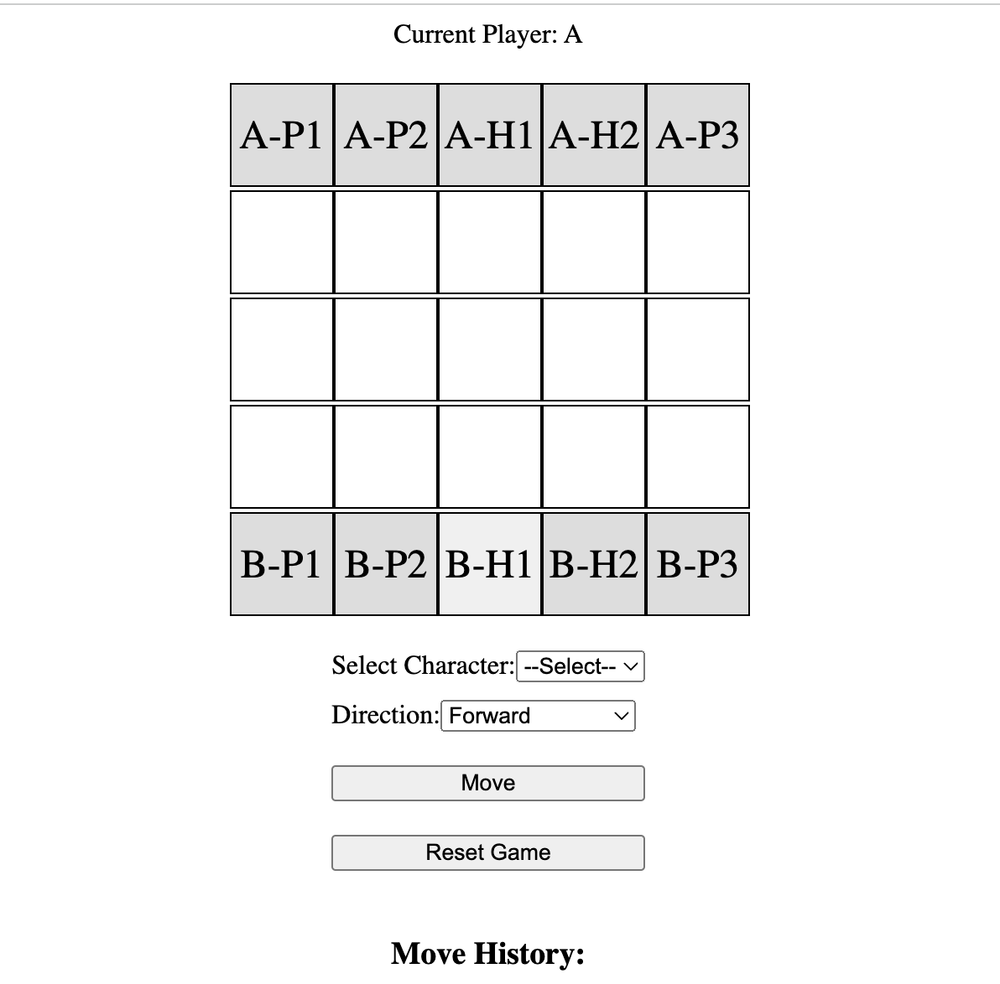

# Project Overview

This repository showcases two distinct phases of a project developed to meet different requirements at each stage. Each phase is contained in its own branch, providing a clear progression from the initial project goals to more advanced features.

## Phase 1: Meeting Initial Requirements

The first phase of the project, available under [Phase 1 - Basic Gameplay](https://chess-like-game-swart.vercel.app/), was designed to fulfill the specific demands outlined in the initial project brief. This version includes all the fundamental features required for a basic, fully functional game, allowing players to engage with the core mechanics as intended. This phase demonstrates the ability to meet the project’s essential criteria effectively and on time.

### Inspiration

This phase takes inspiration from the traditional 8x8 chess gameplay, adapting the strategic depth and mechanics to a smaller 5x5 board while maintaining the essence of the game.

## Phase 2: Introducing AI Gameplay

Building upon the foundation laid in Phase 1, the second phase, accessible via [Phase 2 - AI Gameplay](https://jay6879.github.io/chess-like-game/), introduces an exciting new feature: AI gameplay. In this version, players can now challenge the computer itself, adding a layer of complexity and engagement to the game. This enhancement showcases advanced programming techniques and the ability to expand upon an existing project to meet evolving user needs and expectations.

### Note on AI Development

Due to time constraints, the AI feature is not fully developed. While it introduces basic AI gameplay, further refinements are needed to achieve the desired level of sophistication. The current implementation serves as a foundation for future enhancements.

### Inspiration

The AI gameplay was inspired by the decision-making strategies seen in traditional 8x8 chess, where the computer calculates optimal moves, adding a competitive edge to the game.

## Branches and Marking

Each phase is documented and maintained in separate branches to ensure clarity and allow users to explore the project’s development over time. 

The addition of AI in the second phase represents a significant upgrade, offering users a richer and more dynamic gaming experience.
